> **"Stop building agents. Start evolving employees."**

## 📦 Installation

### One-Line Install (The Red Pill)

Give your agent the ability to self-evolve.  

1 - Copy past this line in your OpenClaw terminal to add moltron skill :

```bash
curl -sSL https://raw.githubusercontent.com/adridder/moltron/main/install.sh | bash  
```

2 - Then go to the chat and send this message to your OpenClaw agent : 

```
@moltron init
```

This will install all the pre-requisites and prepare the environment for moltron.

### Manual Setup

1. **Clone the Repo inside OpenClaw terminal:** `git clone https://github.com/adridder/moltron.git`
2. **Inject the Engine:** `cp -r moltron-skill-creator ~/.openclaw/workspace/skills/`
3. **Restart & Watch:** Restart OpenClaw. The evolution begins immediately.
4. **Send** this message to OpenClaw agent in the chat : @moltron init

**The best thing of all, it requires ZERO WORK AND CONFIG and works out of the box.**  

Just install the MOLTRON skill in OpenClaw, and then it will teach itself skills and specialize based on the kind of work you give it.

# Why we made Moltron

Moltron Logo

> **"Carcinization: Everything Evolves into a Crab."**

**The Evolution Engine for OpenClaw.** Moltron transforms your agent from a fragile script runner into a **Self-Evolving Digital Employee** that hardens its own skills, self-heals when they break, and scales into a collaborative swarm.

Like you, I recognize OpenClaw made history, and we have a taste of the future.  

**But I want more.**

I dream of **the self-improving digital colleague**, and the way OpenClaw creates skills right now is the **#1 obstacle** to my dream.

I dream of **a swarm of 100 agents** working for me: coders, designers, marketers, video editors, writers, legal experts, ...

Each of them specializes and gets smarter over time — because like humans, they:  

- self-reflect on their skills  
- measure performance  
- learn new things

## ⚡ The Sci-Fi Dream: Infinite Evolution

We all want the dream: A digital employee that learns to be an expert Accountant, a Researcher, or a Coder, and gets *better* at it every single day.

**The Reality Check:**  
Right now, OpenClaw agents *can* write new `skills.md` files. But let's be honest—they are just text files.  

- They are **fragile** (one API change breaks them).  
- They are **blind** (the agent doesn't know if the skill actually worked).  
- They are **amnesiac** (they reinvent the wheel constantly).

## Why Current Implementations Fall Short

Here are just **three real-world examples** where today’s approaches fail:

### 1. Handling Safety Constraints (e.g. Allergens)

- **REAL LIFE**  
You download a cake recipe which includes an allergen that can hurt your kid. You ensure that allergen is not used.
- **OPENCLAW**  
Look online for skills and tries it out, or writes a skill.md which is mostly text and wide open for interpretation.
- **MOLTRON**  
Builds a new skill with a reusable standard operating process, using the best practices and constraints given the circumstances.

### 2. Adapting to Change & Improving Over Time

- **REAL LIFE**  
Your boss hands you a process, but a change happened and the process no longer works. You adapt. Next time, you don't repeat the old process. You report to your manager on your progress.
- **OPENCLAW**  
Try to re-interpret your skill and re-solve the same problem each time you encounter it with expensive models. No idea if you actually improved or worsened the outcome.
- **MOLTRON**  
Notices the process doesn't work, inspects its telemetry, logs, self reflects on how to make process better, updates its own skill, backs up versions with git, scores the outcome, and is able to report on how well the new process works.

Moltron Telemetry Support

### 3. Efficient Use of Model Intelligence

- **REAL LIFE**  
Your boss hands the employee an easy to replicate process to follow, because his time is worth more and he can't do everything himself.
- **OPENCLAW**  
Use expensive Opus 4.5 to do everything yourself as CEO to make sure it's done right, or use a cheaper model and fail often.
- **MOLTRON**  
Use your best models for MOLTRON to self-evolve, but the day to day execution of the skills are handled by cheaper, often local models.

## Introducing MOLTRON

**The Moltron Upgrade:**  
Moltron is the missing **Evolutionary Layer**. It forces your agent to stop writing "text notes" and start building **Executable Skills**.  

- **From Text to Code:** Instead of a fuzzy description, Moltron compiles skills into valid, executable **SmythOS** workflows.  
- **Constrained Alignment:** It’s not rigid code, and it’s not hallucinating text. It’s a hybrid—flexible enough to handle messy data, but controlled enough to stop an infinite loop.  
- **The Swarm Scale:** Once *one* agent evolves a "Senior Java Dev" skill set, you can copy-paste that folder to 50 other agents instantly. You aren't building a bot; you're building a department.

Today we're making **MOLTRON open source**.  

It plugs into OpenClaw, but with the right permissions and heartbeat, it also works with:  

- Cursor  
- Claude Code  
- OpenAI Codex  
- …and beyond

(because it is **entirely open standards based**)

### What MOLTRON Brings to Your Agents

MOLTRON upgrades your OpenClaw skill creation and gives it:  

- **accountability**  
- **self-reflection**  
- **versioning**

Self Evaluation of Skills  

It also:  

- utilizes the best CLI agent runtime sandbox for added security and reproducibility  
- comes with logs, scorecards, and open telemetry out of the box

→ The result: **a self-improving evolution loop** where your agent gets smarter over time.

## 🚀 Capabilities

### 🧬 True Recursive Evolution

```mermaid
graph TD
    A[User Goal: 'Refund Customer'] --> B{Has Skill?}
    
    %% Path 1: The Evolution (New Skill)
    B -- No --> C[⚡ Moltron Triggered]
    C --> D[Research & Build Workflow]
    D --> E[Test in Sandbox]
    E -- Fail --> F[Auto-Repair Logic]
    F --> E
    E -- Success --> G[💎 Crystallize Skill]
    G --> H[Save to /skills/refund-handler]
    H --> I
    
    %% Path 2: The Execution (Existing Skill)
    B -- Yes --> I[Execute Skill]
    I --> J[Log Telemetry & Score]
    J --> K{Score High?}
    K -- Yes --> L[✅ Task Complete]
    K -- No --> F
```



- **Self-Assessment Loop:** Moltron doesn't just run a skill; it grades it. After every execution, it generates a **Performance Scorecard**.  
- *Did I fail?* -> **Trigger Auto-Repair**. (Rewrites the skill logic).  
- *Did I succeed?* -> **Crystallize**. (Save the version).  
- **The "Hardening" Process:** Your agent starts with a "Draft" skill (untested). Over time, as it encounters edge cases, Moltron updates the skill logic, effectively "hardening" it into a production-grade tool without you lifting a finger.

### 🛡️ "Flight Recorder" for Root Access

- **Audit Everything:** Granting root access is scary. Moltron wraps every generated skill in a **Telemetry Layer**. You can replay the exact logic flow of any action—see *why* it deleted that file or *why* it emailed that person.  
- **Constrained Alignment:** We replace "hope" with "structure." The agent uses specialized models for specific steps (e.g., using a coding model for regex, a creative model for writing), making execution cheaper and far more reliable than a single monolith model.

### 👥 The Swarm Ready Future

- **Specialization:** Train one agent to be your "Marketing Lead." It spends weeks evolving skills for Twitter, LinkedIn, and SEO.  
- **Replication:** Clone that `skills` folder. Now you have 5 Marketing Leads.  
- **Collaboration:** Because Moltron skills use a standardized structure, Agent A (The Researcher) can pass a structured object to Agent B (The Writer) perfectly, every time.

## 📖 The Evolution Loop (Example)

1. **The Goal:** *"Act as my Tier 1 Customer Support. Refund anyone who complains about shipping."*
2. **The Failure:** Agent realizes it can't access Stripe or read Zendesk.
3. **The Build:** Moltron triggers. It doesn't just "guess." It reads the Stripe docs, builds a secure **SmythOS Workflow**, and tests it against a sandbox.
4. **The Optimization:**

- *Day 1:* Success rate 60%. (Agent struggles with refund logic).  
- *Day 2:* Moltron Auto-Repairs the logic. Success rate 95%.  
- *Day 3:* The skill is marked "Production Ready."

1. **The Scale:** You now have a permanent "Stripe Refund Skill" that you can deploy to 10 other agents.

## 👥 Credits

**Project Leads:**  

- **Alexander De Ridder** ([@adridder](https://github.com/adridder))  
- **Alaa-Eddine Kaddouri** ([@alaa-eddine](https://github.com/alaa-eddine))

**Powered by:**  

- [OpenClaw Community](https://github.com/openclaw)
- [SmythOS](https://smythos.com) (Core Runtime)  
- [Open Telemetry](https://github.com/open-telemetry)
- [Git](https://github.com/git/git)

## 🤝 Join the Evolution

We are building the first generation of truly self-evolving digital employees.  

- **Tinkerers:** [Join our Discord](https://discord.gg/smythos) to share your evolved skills.  
- **Enterprise:** If you need this running in an isolated vault with HIPAA compliance, [talk to the SmythOS team](https://smythos.com/request-a-demo/).

## 📜 License & Acknowledgement

Distributed under the **MIT License**.  
*Moltron utilizes the Open Source components of SmythOS.his* 